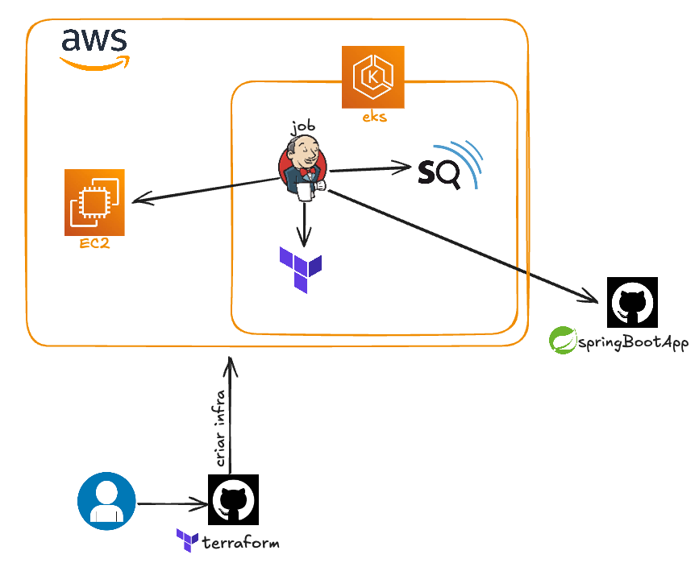

# SimpleSpringApp

A basic Spring boot app that is built in Jenkins, tested with Sonar and deployed to an EC2.
This is the challenge number one from this (list)[https://github.com/diegopacheco/tech-resources/blob/master/devops-resources.md#code-challenges-round-1] and deploys this (app)[https://github.com/luisfneu/spring-boot-app-demo].

